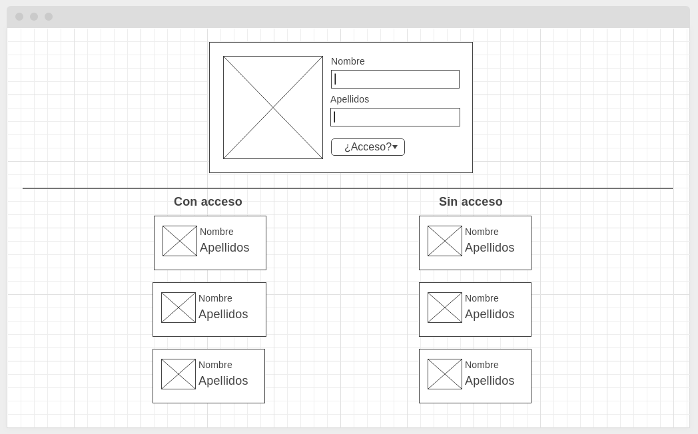

# seguridad-sl

## Contexto

Somos las empresa "Seguridad SL" y nos gustaría poder registrar a todo el personal de nuestra empresa (nombre, apellidos, foto y si se le permite o no el acceso a las zonas restringidas) para llevar un control de quienes de ellos podrán acceder a las zonas restringidas que poseemos en la empresa.

## Objetivo

Debes crear una pequeña aplicación (SPA) para poder gestionar el personal de dicha empresa (crear y editar, no es necesario eliminar) y otorgar o quitar el acceso de estas a las zonas restringidas.

Esta aplicación consta de 2 partes, la parte superior, donde la persona autorizada para tal fin, podrá crear y editar miembros de la empresa y la parte inferior, donde se listará el personal de la empresa en 2 columnas diferencias, la de izquierda listará los miembros que tendrán acceso a la zona restringida y los de la derecha los que no, además siempre que pulse en alguno de los miembros que aparecen en cualquiera de los 2 columnas, los datos de este se cargarán en el formulario de la parte superior y se podrá editar sus datos (nombre, apellidos, foto o permiso a zona restringida)

Se adjunta una imagen (prueba2.png) con un diseño base de la idea, por si esta no queda muy clara en la explicación, dicho diseño no es obligatorio solo es orientativo.

Para ello usaremos las siguientes tecnologías:

## Tecnologías

1. FireBase (todo el mundo puede obtener una cuenta gratuita y usarlo https://firebase.google.com/), en él almacenaremos las fotos de las personas que gestionaremos en la aplicación así como sus datos

2. Aunque lo ideal es que uses como Framework VueJS en la prueba, puedes usar cualquier otra tecnología FRONT que conozcas (React, Angular, Svelte...),  y enseñanos, en mayor o menor medida, todo lo que sabes (ES6, TypeScript, Administración del estado, CSS3, SASS...), tú pones el límite. Un pequeño consejo "Componetiza".

## Respuesta

Una vez concluido tu ejercicio, súbelo a algún repositorio que poseas y pásanos la URL en la respuesta a este email, evidentemente en ese mismo email, puedes indicarnos algo sobre tu ejercicio que quieres que tengamos en cuentas antes de comenzar a revisarlo.

